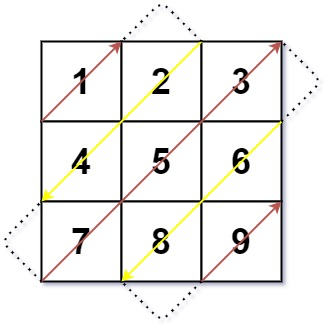

# 498. Diagonal Traverse

## Example 1:



```
Input: mat = [[1,2,3],[4,5,6],[7,8,9]]
Output: [1,2,4,7,5,3,6,8,9]
```

## Example 2:

```
Input: mat = [[1,2],[3,4]]
Output: [1,2,3,4]
```

## Constraints:

- m == mat.length
- n == mat[i].length
- 1 <= m, n <= 10^4
- 1 <= m \* n <= 10^4
- -105 <= mat[i][j] <= 10^5
