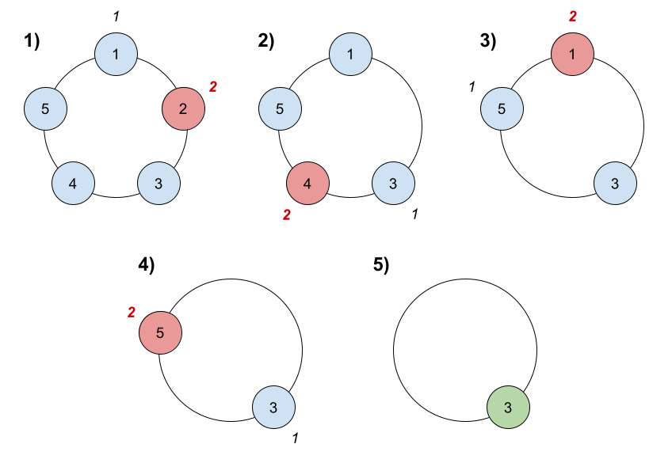

# Find the Winner of the Circular Game

There are n friends that are playing a game. The friends are sitting in a circle and are numbered from 1 to n in clockwise order. More formally, moving clockwise from the ith friend brings you to the (i+1)th friend for 1 <= i < n, and moving clockwise from the nth friend brings you to the 1st friend.

The rules of the game are as follows:

Start at the 1st friend.
Count the next k friends in the clockwise direction including the friend you started at. The counting wraps around the circle and may count some friends more than once.
The last friend you counted leaves the circle and loses the game.
If there is still more than one friend in the circle, go back to step 2 starting from the friend immediately clockwise of the friend who just lost and repeat.
Else, the last friend in the circle wins the game.
Given the number of friends, n, and an integer k, return the winner of the game.

## Example 1:



```
Input: n = 5, k = 2
Output: 3
Explanation: Here are the steps of the game:
1) Start at friend 1.
2) Count 2 friends clockwise, which are friends 1 and 2.
3) Friend 2 leaves the circle. Next start is friend 3.
4) Count 2 friends clockwise, which are friends 3 and 4.
5) Friend 4 leaves the circle. Next start is friend 5.
6) Count 2 friends clockwise, which are friends 5 and 1.
7) Friend 1 leaves the circle. Next start is friend 3.
8) Count 2 friends clockwise, which are friends 3 and 5.
9) Friend 5 leaves the circle. Only friend 3 is left, so they are the winner.
```

## Example 2:

```
Input: n = 6, k = 5
Output: 1
Explanation: The friends leave in this order: 5, 4, 6, 2, 3. The winner is friend 1.
```

## Constraints:

- 1 <= k <= n <= 500

## Follow up:

- Could you solve this problem in linear time with constant space?
